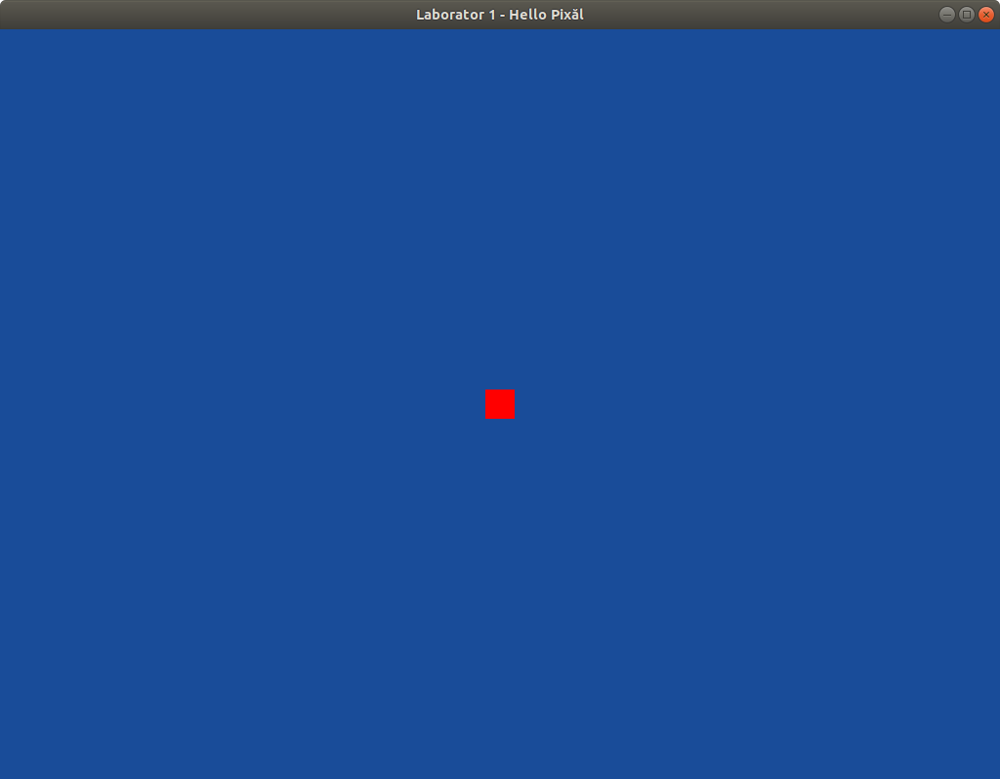

# Hello Pixel!

În această parte a laboratorului veți folosi un shader minimal. Acesta va fi format dintr-un vertex shader și un fragment shader. Acestea sunt programate cu GLSL. Codul lor sursă este hardcodat în programul nostru (vezi <code>createVertexShader</code> și <code>createFragmentShader</code>). Întregul shader este apoi asamblat în metoda <code>createShaderProgram</code>.

Verificați șablonul primit. Dacă este nevoie, faceți modificările necesare ca să ruleze (necesare de ex, din cauza sistemului de operare sau a mediului de dezvoltare). Din directorul laboratorului

    cd pixel/
Compilați
        
    make

Apoi rulați aplicația. Sub linux:

    ./pixel     
Veți obține o fereastră similară cu cea din prima parte a laboratorului. În mijlocul ecranului este însă un pixel roșu.


# Cerințe

1. Schimbați dimensiunea fragmentului folosind <code>glPointSize(30.0f);</code> pentru a obține imaginea de mai jos
    ```c++
    ...
    glUseProgram(renderingProgram);	  // încarcă programul de shading
    glPointSize(30.0f);			  // mărimea default a unui punct în OpenGL este un pixel
    glDrawArrays(GL_POINTS, 0, 1);	  // desenează orice (un punct aici) pentru a activa shader-ul

    ...
    ```
 &nbsp;&nbsp;&nbsp;&nbsp;&nbsp;&nbsp;&nbsp;

2. Refactorizați codul
    * Creați o metodă de inițializare în care mutați codul dinainte buclei principale. Pe viitor, această metodă va conține inițializări pentru OpenGL
    ```c++
        void init(GLFWwindow *window){
                ...
        }
    ```
    * Creați o metodă de desenare în care mutați codul OpenGL din bucla principală. Atenție, doar codul pentru desen! Pipeline-ul OpenGL este activat cu apelul <code>glDrawArrays</code> (deci inclusiv această linie)
    ```c++
        void display(GLFWwindow *window, double currentTime){
                ...
        }
    ```
    Când apelați această metodă din <code>main</code> folosiți <code>glfwGetTime()</code> pentru al doilea parametru. Această metodă returneză timpul scrus de la inițializarea GLFW-ului. Acest parametru va fi folosit ulterior pentru animații.
3. Schimbați poziția și culoarea pixelului modificând codul GLSL.
