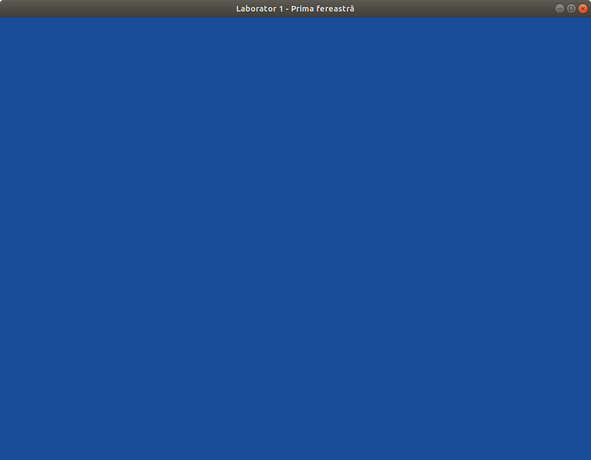

# Prima fereastră

Pentru a construi prima fereastră veți porni de la șablonul primit. În mod normal ar trebui să poată fi compilat așa cum este. Veți avea nevoie de următoarele biblioteci:
* [GLFW (Graphics Library Framework)](https://www.glfw.org)
* [GLEW (OpenGL Extension Wrangler Library)](https://github.com/nigels-com/glew)
* [GLM (OpenGL Mathematics)](https://glm.g-truc.net/0.9.9/index.html)

Cu toate că săptămâna asta nu vom folosi toate aceste biblioteci (cum ar fi cea de mate), vom folosi laboratorul de azi ca schelet pentru toate celelalte laboratoare.

Dacă sunt probleme cu instalarea acestor biblioteci pe diferitele sisteme de operare, puteți consulta următoarele surse:
* [www.opengl-tutorial.org - tutorial 1](http://www.opengl-tutorial.org/beginners-tutorials/tutorial-1-opening-a-window/)
* [Computer Graphics Programming in OpenGL with C++, John L.
Clevenger and V. Scott Gordon - apendix A,B,C](http://dl.booktolearn.com/ebooks2/computer/graphics/9781683922216_Computer_Graphics_Programming_3b7d.pdf)

 Intrați în prima parte a laboratorului. Din directorul laboratorului:

        cd window/

# Cerințe
1. Compilați (deci, bibliotecile menționate mai sus trebuie să fie disponibile):
        
        make

   Apoi rulați aplicația. Sub linux:

        ./window     
   Veți obține:
   
   
2. Schimbați culoarea de fundal.
