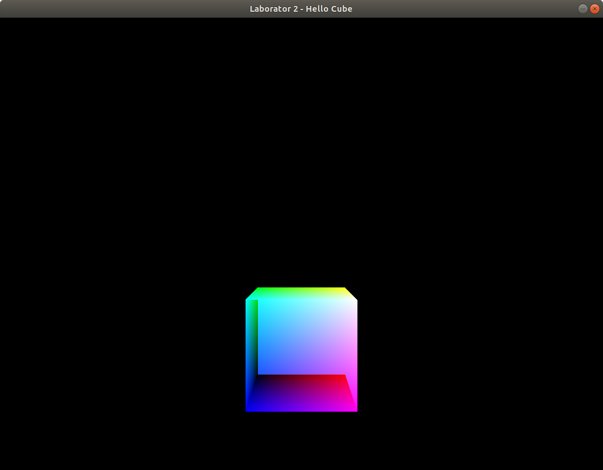

# Hello Cube!

În această parte a laboratorului veți desena un cub transmițând coordonatele punctelor printr-un VBO (vertex buffer object).

Verificați șablonul primit. Dacă este nevoie, faceți modificările necesare ca să ruleze (necesare de ex, din cauza sistemului de operare sau a mediului de dezvoltare). Din directorul laboratorului

    cd cube/
Compilați
        
    make

Apoi rulați aplicația. Sub linux:

    ./cube     
Veți obține imaginea:


# Cerințe

1. Cubul arată așa, deoarce ordinea în care sunt desente fețele este cea în care apar punctele în <code>vertexPositions</code> (nu se ține cont de poziționarea lor în spațiu). Pentru a desena fețele mai apropiate și pentru a acoperi fețele din spate folosiți:
    ```c++
    ...
    glEnable(GL_DEPTH_TEST);
	glDepthFunc(GL_LEQUAL);
	glDrawArrays(GL_TRIANGLES, 0, 36);
    ```

2. Varianta implicită de redare a triunghiurilor este "plin" (cu interior cu tot). Pentru a obține doar marginile triunghiurilor din care este format cubul folosiți:
   ```c++
   ...
   glPolygonMode(GL_FRONT_AND_BACK, GL_LINE);
   glDrawArrays(GL_TRIANGLES, 0, 36);
   ```