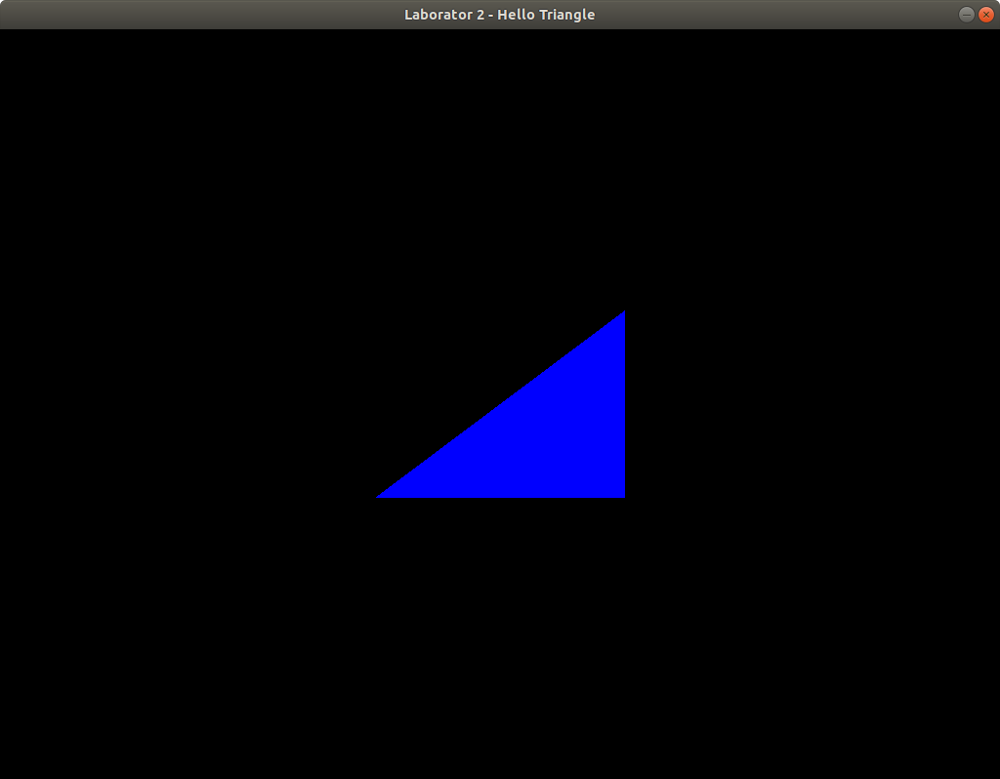

# Hello Triangle!

În această parte a laboratorului codul GLSL (pentru șhadere) a fost mutat în fișiere sursă (vezi <code>shaders/fragment.glsl</code> și <code>shaders/vertex.glsl</code>). Metodele de citire și de asamblare a programului de rendering sunt în <code>main.cpp</code>.

Verificați șablonul primit. Dacă este nevoie, faceți modificările necesare ca să ruleze (necesare de ex, din cauza sistemului de operare sau a mediului de dezvoltare). Din directorul laboratorului

    cd triangle/
Compilați
        
    make

Apoi rulați aplicația. Sub linux:

    ./triangle     
Veți obține un triunghi:



# Cerințe

1. Mică refactorizare: Mutați codul de citire și asamblare a șhaderelor ca metode statice în clasa <code>Utils</code> din directorul <code>common/</code>.

2. Provocați câte o eroare în <code>vertex.glsl</code> și <code>fragment.glsl</code> și verificați mesajul de eroare primit.

3. Adăugați un alt triunghi în scenă. Asta înseamnă că pipelineul trebuie activat pentru 6 puncte: <code>glDrawArrays(GL_TRIANGLES, 0, 6)</code> iar în <code>vertex.glsl</code> vom verifica id-ul pentru încă 3 puncte.

4. Faceți primul triunghi să se miște pe axa Ox (cea orizontală). Pentru asta putem adăuga variabile globale în aplicația c++
    ```c++
    float x = 0.0f;	   // pozitia triunghiului pe axa Ox
    float inc = 0.01f; // pasul cu care mutam triunghiul
    ```
    care să fie actualizate în metoda <code>display(..)</code> astfel:
    ```c++
    x += inc; // modifică poziția triunghiului
	if (x > 1.0f)
		inc = -0.01f; // schimbă direcția spre stânga
   	if (x < -1.0f)
		inc = 0.01f; // schimbă direcția spre dreapta

    ```
    apoi, transmiteți poziția triunghiului, folosind o variabilă uniformă
    ```c++
    	GLuint offsetLoc = glGetUniformLocation(renderingProgram, "offset");
	glProgramUniform1f(renderingProgram, offsetLoc, x);
    ```
    iar în <code>vertex.glsl</code>
    ```c++
    uniform float offset;
    ...
    gl_Position = vec4( ... + offset, ..., 0.0, 1.0);
    ```
5. Schimbă culoarea pixelilor. Cei din stânga ecranului vor avea culoarea roșu iar cei din dreapta, albastru. Pentru asta, în <code>fragment.glsl</code> puteți folosi:
    ```c++
    if (gl_FragCoord.x < ...)
        color = vec4(1.0, 0.0, 0.0, 1.0);
    else ...
    ```
